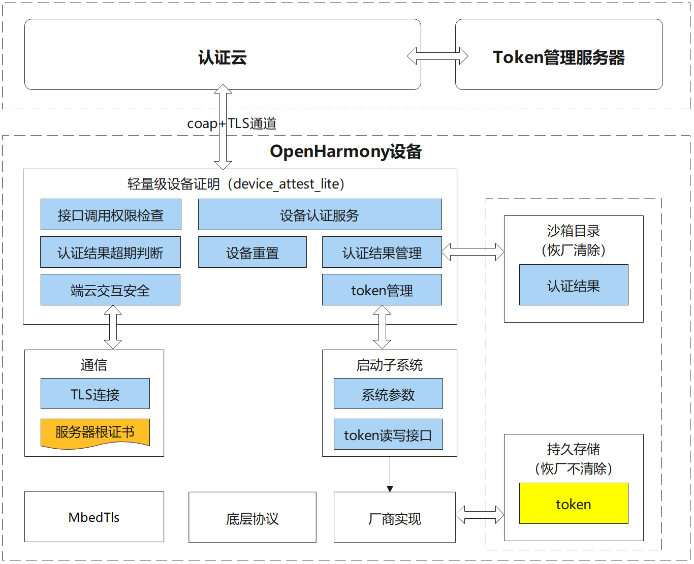
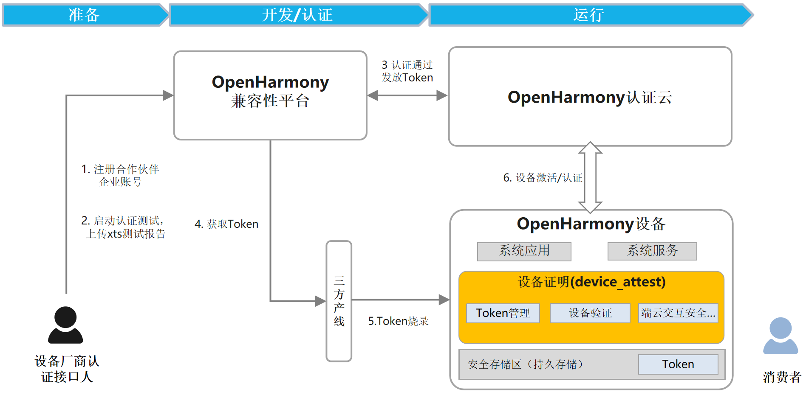

# xts_device_attest_lite部件<a name="ZH-CN_TOPIC_001"></a>

## 简介<a id="section100"></a>

-  xts_device_attest_lite，轻量级设备证明部件，是OpenHarmony compatibility agreement约定需要伙伴在产品中集成的模块，用于支撑伙伴完成产品的兼容性测试。基本功能是看护OpenHarmony生态设备认证结果，通过端侧数据上云，达成统计OpenHarmony生态设备数量的目标。xts_device_attest_lite部件用于轻量系统（mini system）和小型系统（small system）。

## 目录<a id="section200"></a>

```
/test/xts
├── device_attest_lite          # 轻量级设备证明部件代码存放目录
│   └── build                   # 编译配置存放目录
│   └── figures                 
│   └── framework               # 系统能力服务框架
│       └── mini                # 轻量系统服务框架
│       └── small               # 小型系统服务框架
│   └── interfaces              # 对外接口
│   └── services                # 服务主体和业务逻辑代码
│       └── core                # 业务逻辑代码
│   └── test                    # 测试用例编译配置存放目录
│       └── startup             # 小型系统启动示例存放目录
│       └── unittest            # 测试用例代码存放目录
```

## 架构图<a id="section300"></a>

-   设备运行时，设备证明采集设备数据，与OpenHarmonoy认证云进行端云认证，OpenHarmony认证云将设备数据与云端登记的数据进行比对，成功则判断设备合法，否则非法。同时记录设备数据，能够统计计数。端云验证结束后，云端将判定结果下发给端侧。端侧可进一步将判定结果共享给其他业务使用。比如系统服务、系统应用等，供判定设备是否已通过认证。



## 约束<a id="section400"></a>

**表 1 轻量级设备证明的集成依赖库**
| 库名称    | 版本号           | 功能描述                                        | 仓库路径                                     |
| --------- | ---------------- | ----------------------------------------------- | ---------------------------------------- |
| mbedtls   | 2.16.11          | 供嵌入式设备使用的一个 TLS 协议的轻量级实现库。 | third_party\mbedtls           |
| cJSON     | 1.7.15           | JSON 文件解析库。                               | third_party\cJSON |
| libsec    | 1.1.10           | 安全函数库。                                    | bounds_checking_function      |
| parameter | OpenHarmony 1.0 release及之后版本 | 获取设备信息的系统接口。                        |base\startup\init\interfaces\innerkits\include\syspara\parameter.h                    |

## 对外接口<a id="section500"></a>

**表 2 轻量级设备证明部件对外接口**

| **接口名**                                              | **描述**     |
| ------------------------------------------------------- | ------------ |
| int32_t  StartDevAttestTask(void);                           | 启动轻量级设备证明主流程 |
| int32_t  GetAttestStatus(AttestResultInfo* attestResultInfo); | 获取证明结果 |

轻量级设备证明需要厂商在网络连接成功后主动调用StartDevAttestTask函数，进入轻量级设备证明的流程。通过调用GetAttestStatus接口，可以得到设备证明结果。

## 集成指导<a id="section600"></a>

### 名词解释<a id="section601"></a>

**表 3 名词解释** 
| 名词       | 解释                                                         |
| ---------- | ------------------------------------------------------------ |
| 伙伴       | 申请 OpenHarmony 兼容性测评的企业，下文统称为“伙伴”。需要集成设备证明部件。 |
| manuKey    | 伙伴从[OpenHarmony 兼容性平台](https://openatom.cn/atomavatar/#/login?redirect=%2Fauthorize%3Fresponse_type%3Dcode%26client_id%3D6bdacef0a8bd11ec938bd9550d2decfd%26redirect_uri%3Dhttps%3A%2F%2Fcompatibility.openharmony.cn%2Fconsole%26appName%3DOpenHarmony%E8%AE%A4%E8%AF%81%E5%B9%B3%E5%8F%B0%26scope%3D0,1,2,3%26state%3D%2Fpersonal)官网获取的秘钥。用于对产品中相关数据进行加密保护。为了保证多产品的兼容性，manuKey 在所有产品的生命周期内都应保持不变。 |
| productId  | 伙伴从 OpenHarmony 兼容性平台官网申请兼容性测评时，平台为测评产品分配的唯一产品标识。productId 在产品生命周期内需保证始终不变。 |
| productKey | 伙伴从 OpenHarmony 兼容性平台官网申请兼容性测评时，平台为测评产品分配的唯一产品秘钥。其与 productId 一一对应，用于对产品级的数据进行加密保护。同样需保证在产品生命周期内始终保持不变。 |
| 软证书     | 伙伴从 OpenHarmony 兼容性平台官网获取，由平台分配的设备凭据，每台设备一个，标识设备身份。需存储在安全分区，在恢复出厂设置、镜像升级时也不能被清除。 |
### 伙伴集成流程 <a id="section602"></a>
1、环境准备：[伙伴完成信息信息登记](#section603)、[轻量级设备证明部件依赖接口适配](#section604)
2、集成与验证：[编译](#section605)、[烧录](#section606)、[验证](#section607)

#### 伙伴完成信息登记 <a id="section603"></a>

伙伴需要在[OpenHarmony 兼容性平台](https://openatom.cn/atomavatar/#/login?redirect=%2Fauthorize%3Fresponse_type%3Dcode%26client_id%3D6bdacef0a8bd11ec938bd9550d2decfd%26redirect_uri%3Dhttps%3A%2F%2Fcompatibility.openharmony.cn%2Fconsole%26appName%3DOpenHarmony%E8%AE%A4%E8%AF%81%E5%B9%B3%E5%8F%B0%26scope%3D0,1,2,3%26state%3D%2Fpersonal)网上注册关于产品设备的一系列基础信息，如：公司简称（英文）、品牌英文名称、设备型号等。
在设备证明处理流程中，设备证明部件读取设备信息并上报基金会云，基金会云进行校验验证。因此需要伙伴提前在 OpenHarmony 兼容性平台官网上完成产品的信息登记，分如下两个步骤：  
1）伙伴在 OpenHarmony 兼容性平台官网上完成设备信息登记。  
2）伙伴将 OpenHarmony 兼容性平台官网上登记的设备信息写入设备。  

##### 伙伴在 OpenHarmony 上完成信息登记

    伙伴需要在 OpenHarmony 兼容性平台上注册相关设备证明数据，请按照官网上的注册流程完成。

##### 伙伴将登记OS信息写入设备

    针对伙伴在 OpenHarmony 兼容性平台上登记的信息，版本包提供了相关接口供伙伴进行填写。
在调用设备证明函数时，会将伙伴填写的值上报给基金会云，基金会云会将上一节注册的信息与设备上报的信息进行对比校验。
设备证明部件依赖部分设备信息，需要伙伴适配修改。  
设备信息位于启动恢复子系统中的 base/startup/init/services/etc_lite/param/ohos_const/ohos.para 文件下。设备OS信息如下表：

**表 4 设备OS信息对应配置参数** 
| 设备信息         | ohos.para 配置参数                                           | 备注                         |
| --------------- | ------------------------------------------------------------ | ---------------------------- |
| 发布类型         | const.ohos.releasetype=Beta                                 | 使用默认值    |
| api版本          | const.ohos.apiversion=6                                     | 使用默认值    |
| 安全补丁标签     | const.ohos.version.security_patch=2021-09-01                | 2021-09-01需要替换成真实值   |
| 软件版本号       | const.ohos.fullname=OpenHarmony-1.0.1.0                      | 使用默认值 |


设备信息位于芯片的系统参数中的 vendor/hisilicon/hispark_pegasus/hals/utils/sys_param/vendor.para 文件下。设备产品信息如下表：

**表 5 设备产品信息对应配置参数** 
| 设备信息         | vendor.para 配置参数                                | 备注                         | 
| ---------------- | ------------------------------------------------- | ---------------------------- |
| 企业简称（英文）  | const.product.manufacturer=****                  | **** 需要替换成设备真实值 |
| 品牌英文名        | const.product.brand=****                         | **** 需要替换成设备真实值 |
| 设备型号         | const.product.model=****                            | **** 需要替换成设备真实值    |
| 软件版本号       | \# const.product.software.version="OpenHarmony 1.0.1"    const.product.software.version=OpenHarmony 3.3.3.3 | "OpenHarmony 1.0.1"  需要替换成设备真实值 |
| 版本 id          |                                                     | 不需要伙伴操作，系统自动生成 |
| 版本 Hash        | const.ohos.buildroothash=default                    | 添加该数据 default需要替换成设备真实值|


注：版本 id 需要通过设备获得，填写在 OpenHarmony 兼容性平台，版本 id的组成如下：
VersionId = deviceType/manufacture/brand/productSeries/OSFullName/productModel/softwareModel/OHOS_SDK_API_VERSION/incrementalVersion/buildType

版本 id获取:   
    1) 完成OS信息和产品信息写入设备后  
    2) 放开加密日志(修改下图中PrintDevSysInfo修改的地方)  
    3) 烧录  
    4) 通过日志查看当前版本 id  

 

最后通过日志查看当前版本 id

 
  

#### 轻量级设备证明部件依赖接口适配 <a id="section604"></a>

为了屏蔽不同模组底层实现差异，vendor中定义了软证书相关 API，由伙伴具体适配实现，接口定义如下表：

**表 6 伙伴待适配接口** 
| 功能                                            | 接口定义                                                   | 参数定义                                                     | 返回值                | 归属文件                  |
| ----------------------------------------------- | ---------------------------------------------------------- | ------------------------------------------------------------ | --------------------- | ------------------------- |
| 读取 manuKey                                    | int32_t HalGetManufactureKey(char\* manuKey, uint32_t len) | acKey：秘钥存储内存 len：内存长度                          | 0：成功      -1：失败 | ..\hal_token.h |
| 读取 ProductId                                  | int32_t HalGetProdId(char\* productId, uint32_t len)    | productId：产品型号标识len：存储空间长度                     | 0：成功    1：失败    | ..\hal_token.h |
| 读取软证书                                      | int32_t HalReadToken(char\* token, uint32_t len);          | token：存储软证书的空间len：存储软证书的长度                 | 0：成功     1：失败   | ..\hal_token.h |
| 写入软证书                                      | int32_t HalWriteToken(char\* token, uint32_t len);         | token：存储软证书的空间len：存储软证书的长度                 | 0：成功    1：失败    | ..\hal_token.h |
| 读取 ProductKey（预留接口，暂时不需要伙伴适配） | int32_t HalGetProdKey(char\* productKey, uint32_t len)  | productKey：型号产品（唯一）秘钥len：每个型号产品（唯一）秘钥 | 0：成功      1：失败  | ..\hal_token.h |


    1. HalGetManufactureKey  
    manuKey 是和软证书配套，生成 AES 秘钥的参数，具体从 OpenHarmony 兼容性平台下载。  


    通过工具把 ASCII 码转化成 16 进制。  
  


  


    预置在 HalGetManufactureKey 接口的返回值里。  


    2. HalGetProdId  
    ProductId 是和软证书配套，生成 AES 秘钥的参数，具体可以在 OpenHarmony 平台查看。  


    预置在 HalGetProductId 接口的返回值里。  


    3. HalReadToken 和 HalWriteToken
    厂商需要实现软证书读和写接口，把软证书写在设备的安全分区，设备重启、初始化都不会擦除的分区。

    4. HalGetProdKey  
    预留接口，暂时不需要实现。

#### 编译指令<a id="section605"></a>
##### mini设备<a id="section6051"></a>

```c
hb set
选择 设备类型
hb build --gn-args build_xts=true
(注)：若不追加--gn-args build_xts=true，不会编译xts_device_attest_lite部件。
```

编译成功后，在out/芯片类型/产品类型/libs路径下生成libdevattest_core.a和libdevattest_sdk.a
##### small设备<a id="section6052"></a>
LiteOS：
```c
hb set
选择 设备类型
hb build --gn-args build_xts=true
(注)：若不追加--gn-args build_xts=true，不会编译xts_device_attest_lite部件。
```
Linux:
```c
hb set
选择 设备类型
hb build --gn-args build_xts=true
(注)：若不追加--gn-args build_xts=true，不会编译xts_device_attest_lite部件。
```

编译成功后，在out/芯片类型/产品类型/usr/lib下生成libdevattest_core.so、libdevattest_server.so、libdevattest_client.so

#### 烧录<a id="section606"></a>
伙伴在完成 OpenHarmony 的构建后，需要将编译出的镜像文件烧录到设备上，以对开发的代码进行调试和验证。由于不同设备的烧录方式各不相同，本文档mini设备以 OpenHarmony 中 Hi3861 环境教程为例，实际的烧录方式需要伙伴根据实际情况进行调整。
Hi3861 环境可参考[OpenHarmony-Hi3861 开发板操作梳理](https://blog.csdn.net/nanzhanfei/article/details/115841263?spm=1001.2014.3001.5501)官网中的烧写章节。Small设备以 OpenHarmony 中 Hi3516 环境教程为例，实际的烧录方式需要伙伴根据实际情况进行调整。
Hi3516 环境可参考[OpenHarmony代码操作总结](https://blog.csdn.net/nanzhanfei/article/details/115409538)官网中的烧写章节。

#### 验证<a id="section607"></a>
伙伴在完成信息注册、写入设备信息到 OpenHarmony 认证云、以及完成设备证明功能打包为最终镜像后，即可通过烧录镜像文件到设备上，进而对 OpenHarmony设备证明功能进行验证。  
设备证明结果在设备中以 key-value 字段保存，key 值是 attest.auth.result，value 字段如下：

| value 值   | 设备证明结果 |
| ---------- | ------------ |
| attest_ok    | 成功         |
| attest_error | 失败         |

查看方式有以下两种：  
1）日志打印:
 
2）接口查看设备证明结果（仅适用Small设备）。

查看设备证明结果需伙伴实现： 

int GetParameter(const char *key, const char *def, char \*value, unsigned int len);

具体实现详见: https://gitee.com/openharmony/startup_syspara_lite/blob/master/interfaces/innerkits/native/syspara/include/parameter.h

## 相关仓<a id="section700"></a>

[xts\_device\_attest](https://gitee.com/openharmony-sig/xts_device_attest/)

**xts\_device\_attest\_lite**
